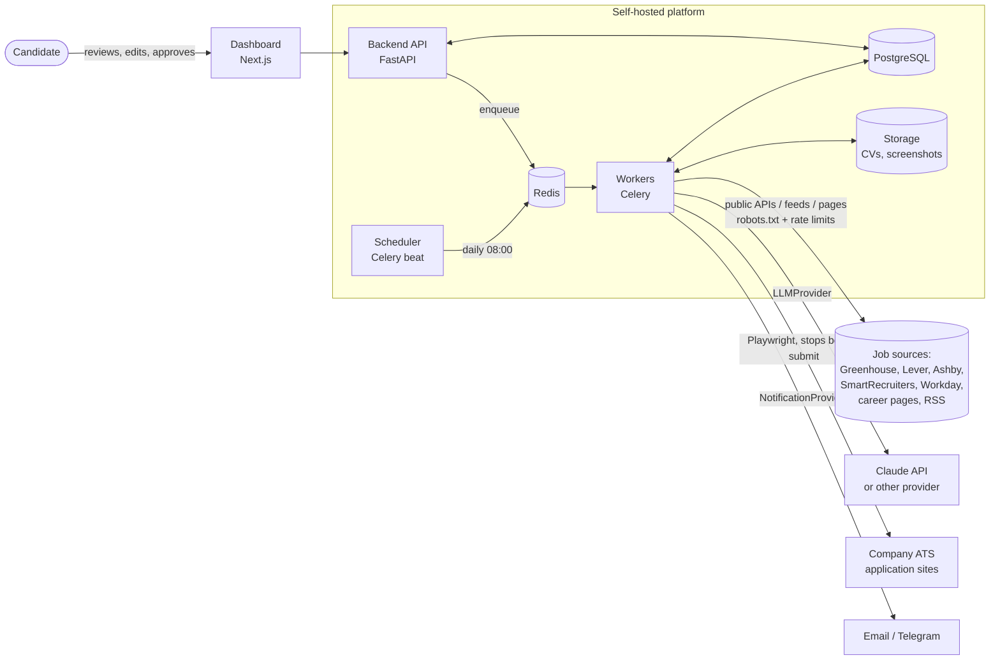
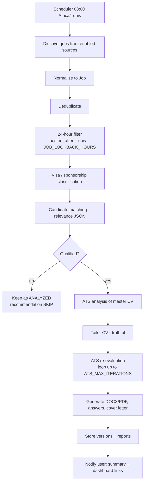
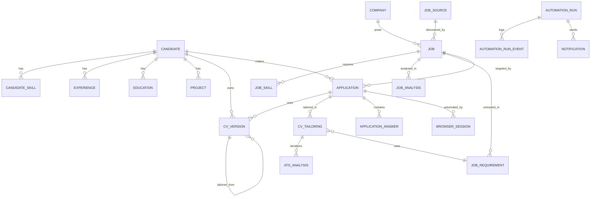
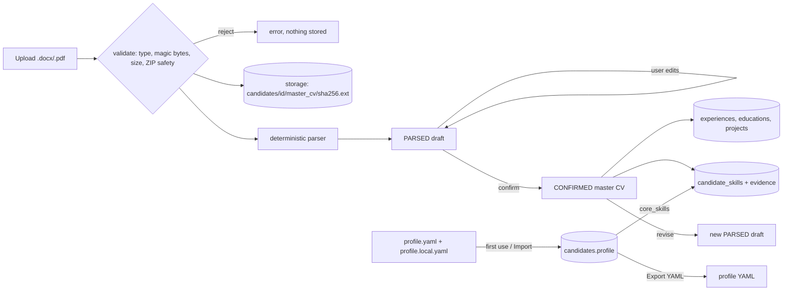
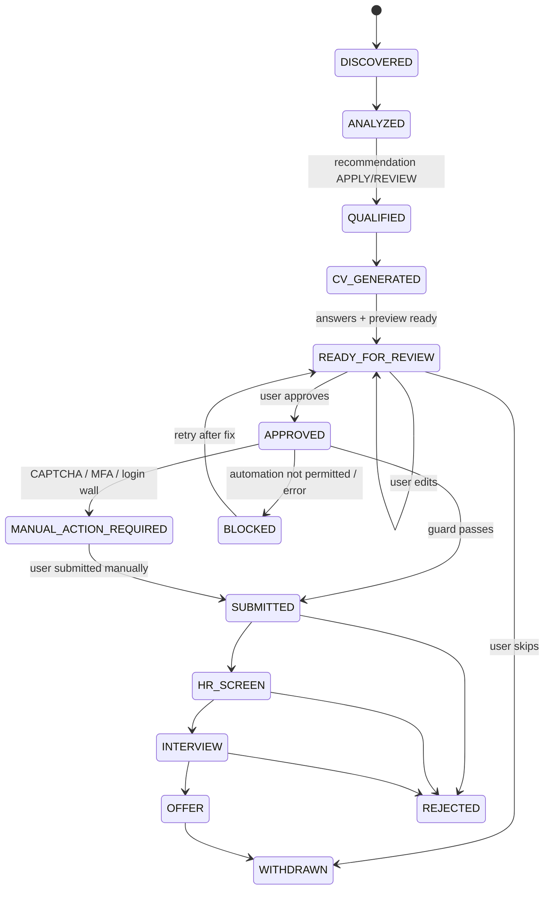
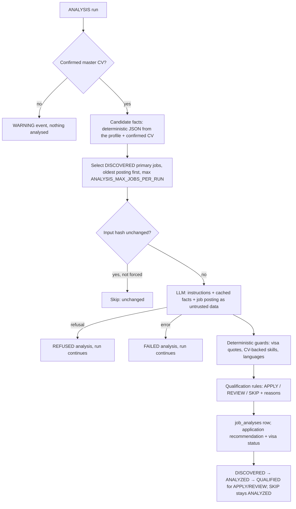
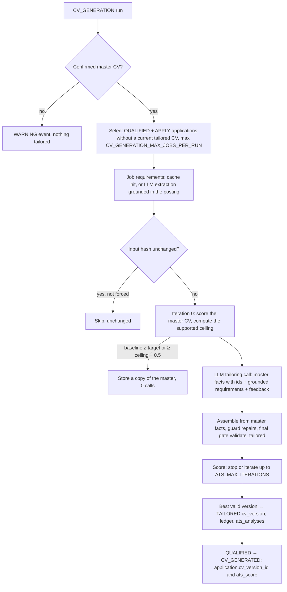

# Architecture — AI Job Application Agent

> Status: **Phase 1 (Foundation) implemented.** Sections describing later phases are the agreed
> design; each phase may refine details and must record deviations in the ADR log at the end.

## 1. Purpose

A self-hosted platform that, for one candidate (multi-candidate ready), continuously:

1. **Discovers** newly posted AI/ML/GenAI jobs from permitted sources (public ATS APIs, career pages,
   feeds), deduplicates them and applies a 24-hour posting window.
2. **Analyses** each job: visa/sponsorship evidence, relevance to the candidate, requirements.
3. **Generates** a truthful, job-specific CV optimised for ATS readability (target score 95, never by
   fabrication), plus a cover letter and application answers when useful.
4. **Prepares** the application in the company's real ATS with a browser, stopping before submission.
5. **Submits** only after explicit human approval, where automation is permitted and no security
   challenge is present, and records everything.

## 2. Guiding principles

| Principle | Consequence in the design |
|---|---|
| **Human in control** | `AUTO_SUBMIT=false` by default; submission requires an approval recorded in the audit log. |
| **Truthfulness** | The master CV is the source of truth. A *truthfulness guard* rejects any generated content that adds employers, titles, dates, technologies, certifications, education or metrics absent from it. Unknown answers become `NEEDS_USER_INPUT`. |
| **Compliance** | Public APIs/feeds preferred; `robots.txt`, site terms and per-domain rate limits respected; CAPTCHA/MFA/anti-bot never bypassed → "Manual action required." |
| **Safety by default** | `MOCK_MODE=true` by default; mock mode can only touch mock ATS pages. |
| **Provider independence** | Every external dependency sits behind an interface (LLM, job sources, notifications, storage, browser, error tracking). Claude is the first LLM provider, not a hard dependency. |
| **Self-hosted & open source** | PostgreSQL, Redis, FastAPI, Celery, Next.js, Playwright, LibreOffice. No paid SaaS except the LLM API, isolated behind `LLMProvider`. |
| **Explainability** | Decisions are structured (JSON with evidence quotes), not a single opaque score. ATS scores are computed deterministically from recorded evidence. |
| **Observability** | Every automation run, every run step and every application action is persisted and visible in the UI. |

## 3. System context



## 4. Containers (Docker Compose)

| Service | Image / tech | Responsibility | Phase |
|---|---|---|---|
| `postgres` | postgres:16-alpine | System of record | 1 |
| `redis` | redis:7-alpine | Celery broker/result backend; later rate-limit buckets | 1 |
| `migrate` | backend image | `alembic upgrade head`, runs once before API/worker start | 1 |
| `backend` | backend image, uvicorn | REST API (`/api/v1`), OpenAPI docs, health checks | 1 |
| `worker` | backend image, Celery | Executes runs and pipeline stages; later a `browser` queue (concurrency 1) with Playwright + LibreOffice | 1 |
| `frontend` | Next.js standalone | Dashboard; server-side proxy to the API | 1 |
| `scheduler` | backend image, Celery beat | Daily pipeline trigger (`DAILY_RUN_TIME` in `TIMEZONE`) | 11 |
| `mock-ats` | static server | Mock Greenhouse/Lever/generic ATS pages for safe automation tests | 8 |
| `n8n` (profile `n8n`) | n8n Community Edition (free, self-hosted) | Optional integration layer: notifications, job-alert email ingestion, extras (§19); the core never depends on it | 1 (service), 3/10/11 (workflows) |

All published ports are bound to `127.0.0.1`. The browser only talks to the frontend; the frontend's
server talks to the API with a bearer token that never reaches the browser.

## 5. Repository layout

The repository root is the `job-agent/` monorepo root.

```
backend/                 FastAPI app + all domain code (Python package `app`)
  app/api/               HTTP layer: routers, dependencies, error handlers
  app/core/              config, logging, redaction, errors, security, storage, queue, clock
  app/db/                SQLAlchemy base/session, Alembic migrations
  app/models/            ORM models
  app/schemas/           Pydantic API schemas
  app/services/          use-case services (health, runs, audit, diagnostics, candidate
                         profile, master CV, skills, …)
  app/cv/                master CV: file validation, DOCX/PDF readers, deterministic parser,
                         dates, section headings, skill evidence — Phase 2
  app/analysis/          job analysis: candidate facts, visa phrase rules, sponsorship need,
                         CV-backed skill matching, languages, qualification rules — Phase 4
  app/crawlers/          JobSource implementations — Phase 3/10
  app/ats/               ATS engine (Phase 5) and ATS form adapters (Phase 8)
  app/browser/           ApplicationBrowser / BrowserProvider (Playwright) — Phase 8
  app/llm/               LLMProvider protocol, Claude (official SDK) and mock providers, prompt
                         registry, provider factory — Phase 4
  app/applications/      application preparation, approval, submission guard — Phase 7/9
  app/notifications/     NotificationProvider + email/telegram — Phase 11
  tests/                 unit/ and integration/
workers/                 Celery app + thin task wrappers (package `job_agent_workers`)
frontend/                Next.js 16 (App Router, TypeScript, Tailwind CSS)
playwright/              Dashboard E2E tests; mock ATS sites (Phase 8)
crawler/                 Source configuration, company watchlist seed, mock job fixtures
prompts/                 Versioned LLM prompt templates
candidate/               profile.yaml; master_cv/ (git-ignored)
storage/                 Runtime files (git-ignored)
scripts/                 setup, env generation, OpenAPI export, tests.json update, E2E sample CV
docker/                  Dockerfiles
n8n/                     optional n8n integration: README + exported workflows (no credentials)
docs/                    architecture, implementation plan, security
```

Python is a **uv workspace** (root `pyproject.toml` is virtual): `backend` (distribution
`job-agent-backend`) and `workers` (`job-agent-workers`, depends on the backend). The backend never
imports the workers package; it enqueues tasks **by name** using constants in `app/core/tasks.py`.

## 6. Processing pipeline

The system separates five stages with different automation levels:

| Stage | Automation | Human involvement |
|---|---|---|
| A. Discovery | full | none |
| B. Analysis (visa, relevance, requirements) | full | reviews results |
| C. CV generation (tailoring + ATS loop) | full | may edit |
| D. Application preparation (answers, form filling, preview) | full, stops before submit | reviews exactly what will be submitted |
| E. Submission | only after approval | **explicit approval required** |

Daily workflow (Phase 11 wires it to the scheduler; each step is also runnable on demand):



Every execution is an **AutomationRun** with counters (`jobs_discovered`, `jobs_processed`,
`jobs_qualified`, `cv_generated`, `applications_prepared`, `applications_submitted`), an error list and
a timeline of **RunEvents**. A failure of one job never aborts the run: it is recorded and the run ends
`PARTIAL_SUCCESS`.

## 7. Core abstractions

All interfaces are `typing.Protocol`s; implementations are selected by configuration.

```python
class LLMProvider(Protocol):                       # app/llm — Phase 4 (implemented)
    name: str
    model: str
    def generate_structured(self, request: LLMRequest, output_type: type[T]) -> LLMResult[T]: ...
    def generate_text(self, request: LLMRequest) -> LLMResult[str]: ...
    def health_check(self, *, live: bool = False) -> ProviderHealth: ...
# Implementations: ClaudeProvider (official `anthropic` SDK: JSON-schema structured output validated
# with Pydantic after checking `stop_reason`, effort, refusal fallback, prompt caching, usage and
# served model recorded) and MockLLMProvider (deterministic responders, used in tests and offline mock
# mode). Later: OpenAIProvider, OllamaProvider, LocalModelProvider.

class JobSource(Protocol):                          # app/crawlers — Phase 3/10
    key: str
    def search(self, query: JobQuery) -> Iterable[RawJob]: ...   # query carries posted_after/posted_before
    def get_job(self, source_job_id: str) -> RawJob | None: ...
    def normalize(self, raw: RawJob) -> NormalizedJob: ...
    def health_check(self) -> SourceHealth: ...

class NotificationProvider(Protocol):               # app/notifications — Phase 11
    channel: str
    def send(self, message: Notification) -> DeliveryResult: ...

class StorageProvider(Protocol):                    # app/core/storage.py — Phase 1 (implemented)
    def put_bytes(self, key: str, data: bytes) -> StoredObject: ...
    def get_bytes(self, key: str) -> bytes: ...
    def exists(self, key: str) -> bool: ...
    def delete(self, key: str) -> None: ...
    def list(self, prefix: str = "") -> list[str]: ...

class BrowserProvider(Protocol):                    # app/browser — Phase 8
    def new_session(self, options: BrowserOptions) -> BrowserSessionHandle: ...

class ApplicationAdapter(Protocol):                 # app/ats/adapters — Phase 8
    ats_type: str
    def matches(self, url: str, page: Page) -> bool: ...
    def discover_fields(self, page: Page) -> list[FormField]: ...
    def fill(self, page: Page, plan: FillPlan) -> FillReport: ...
    def detect_challenge(self, page: Page) -> Challenge | None: ...
    def submit(self, page: Page) -> SubmissionResult: ...          # only via SubmissionGuard

class ErrorTracker(Protocol):                       # app/core/error_tracking.py — Phase 1 (implemented)
    def capture_exception(self, exc: BaseException, *, context: Mapping[str, object] | None = None) -> str: ...
    def capture_message(self, message: str, *, level: str = "error", context: ... = None) -> str: ...
```

Adapters: `GreenhouseAdapter`, `LeverAdapter`, `WorkdayAdapter`, `AshbyAdapter`,
`SmartRecruitersAdapter`, `GenericAdapter`. Selectors are never global: each adapter resolves fields
through resilient strategies (accessible label → role/name → `name`/`id` attributes → label-text
similarity) with per-ATS overrides kept as data.

## 8. Data model

UUID primary keys, `timestamptz` (UTC) timestamps, JSONB for structured payloads, enum-like columns as
`VARCHAR` + named `CHECK` constraints, constraint naming convention for stable Alembic migrations.
Candidate-scoped tables carry `candidate_id` (multi-candidate readiness).



| Entity | Key fields | Phase |
|---|---|---|
| `automation_runs` | run_type, trigger, status, started_at, finished_at, the six counters, error_count, errors, parameters, summary, task_id | **1** |
| `automation_run_events` | run_id, level, stage, message, data | **1** |
| `audit_logs` (append-only) | actor, action, entity_type, entity_id, request_id, details | **1** |
| `candidates` | slug, validated `profile` JSONB (identity, contact, work authorization, relocation, targets, core skills, application defaults, CV policy), denormalised identity columns, `profile_version` | **2** |
| `candidate_skills` | name, normalized_name (unique per candidate), category, sources (`MASTER_CV`/`PROFILE_DECLARED`), strength (`DEMONSTRATED`/`LISTED`/`NONE`), evidence excerpts, cv_version_id | **2** |
| `experiences`, `educations`, `projects` | rebuilt from the confirmed master CV: position, title/employer/location (degree/institution, name), `date_text`, start/end date + precision (`YEAR`/`MONTH`), is_current, bullets, details, technologies | **2** |
| `companies` (watchlist) | name, career_url, country, ats_type, board token, target_roles, enabled, last_checked_at | 3 |
| `job_sources` | key, kind (ATS_API/FEED/CAREER_PAGE/BOARD), enabled, config, rate limit, compliance notes, last status | 3 |
| `jobs` | spec fields (source, source_job_id, company, title, description, location, country, remote_status, employment_type, seniority, salary_*, posted_at, discovered_at, application_url, company_url, ats_type, visa_information, relocation_information, required/preferred skills, languages, education/experience requirements, responsibilities, raw_content, content_hash) + `posting_date_status`, `canonical_url`, `duplicate_of_id`, visa fields | 3 |
| `job_skills` | name, normalized_name, category, importance (REQUIRED/PREFERRED), evidence_quote — the posting's listed skills only; Phase 5 keeps its requirement set in `job_requirements` | 3 |
| `job_analyses` | application, candidate, job, CV version, run; status (`SUCCEEDED`/`REFUSED`/`FAILED`); provider, requested and served model, fallback flag; prompt name, version and sha256; input hash; request id; input/output/cache-read/cache-write tokens, duration; `visa` and `relevance` JSONB (validated), visa status, recommendation, the model's recommendation, rule reasons; redacted error code and message | **4** |
| `applications` | spec §18 fields + candidate_id, `recommendation` (`APPLY`/`REVIEW`/`SKIP`) and `visa_status` from the latest analysis, approval metadata, blocked/manual reason | **3**, **4**, 9 |
| `cv_versions` | kind (`MASTER`/`TAILORED`), version (unique per candidate + kind), status (`PARSED`/`CONFIRMED`/`SUPERSEDED` for masters, `GENERATED`/`SUPERSEDED` for tailored versions; a kind/status CHECK; one active master and one current tailored version per application via partial unique indexes), original filename, content type, size, sha256, storage key (required for masters only, `ck_cv_versions_master_file`), extracted text, `structure` JSONB (the ParsedCV shape for both kinds), parse warnings, parser version, revised_from_id, confirmed_at; tailored versions add application_id, job_id, base_version_id (the master they come from), run_id, the `evidence` ledger JSONB and `ats_score` — generated files in Phase 6 | **2**, **5**, 6 |
| `job_requirements` | job, run; status (`SUCCEEDED`/`REFUSED`/`FAILED`); provider, requested and served model, fallback flag; prompt name, version and sha256; input hash (one `SUCCEEDED` row per job + input hash: the candidate-independent extraction cache); request id, tokens, duration; grounded `extraction` JSONB with what was discarded; redacted error | **5** |
| `cv_tailorings` | one row per tailoring attempt: application, candidate, job, run, master version, requirements row, stored CV version; status (`SUCCEEDED`/`REFUSED`/`FAILED`), `stop_reason`, input hash; scoring version, `weights`, target, iteration cap; baseline, final and ceiling scores, iterations used, best iteration; `requirements` snapshot and `gaps` JSONB; provider, models, prompt, tokens, duration, redacted error | **5** |
| `ats_analyses` | one row per scored or attempted document of a tailoring (iteration 0 = the master CV): document kind, status (`SCORED`/`REPAIRED`/`REJECTED`/`FAILED`/`REFUSED`), selected flag, scoring version, score; `components`, `keywords`, `recommendations` (feedback), `stuffing`, `violations` JSONB, repairs count, the `document`; served model, request id, tokens, duration, error | **5** |
| `application_answers` | question, normalized key, answer, status (`DRAFT`/`NEEDS_USER_INPUT`/`APPROVED`), sources | 7 |
| `browser_sessions` | adapter, status, step, screenshots, error, manual_action_required, encrypted storage state | 8 |
| `notifications` | channel, status, subject, body, error, sent_at, run_id | 11 |

### 8.1 Candidate facts (Phase 2 — implemented)



- **Profile**: the database is the live copy; YAML is the seed and the import/export format. Every
  change bumps `profile_version` (a stale version is rejected with `409`) and is audited with the names
  of the changed sections only. Required-but-empty fields are reported as `needs_user_input`.
- **Master CV**: uploads are parsed synchronously within strict limits (5 MB by default, 10 pages,
  3,000 lines). The parser only trims, splits and classifies text — a property test checks that every
  parsed value is a substring of the document. Drafts carry warnings (missing dates, unrecognised
  sections); confirmation requires complete entries (titles, degrees, names, end ≥ start).
- **Fact base**: confirming rebuilds the fact tables and the skill evidence in the same transaction.
  Later phases (ATS, tailoring, answers) read only the confirmed version.
- **Skill evidence**: `DEMONSTRATED` when used in an experience or project, `LISTED` when only listed
  (skills, summary, education, certifications), `NONE` when only declared in the profile — such skills
  are never used for tailoring. Matching respects word boundaries and knows synonyms
  (`k8s` → Kubernetes, "large language models" → LLMs, "vision par ordinateur" → Computer Vision).

### 8.2 Application lifecycle

An `Application` row is created per (candidate, job) once a job passes deduplication and the posting
window; it then tracks the job through the whole pipeline.



Jobs that are analysed but not qualified stay `ANALYZED` with `recommendation=SKIP` and are hidden from
the review queue. Every transition is validated by a transition table
(`app/applications/lifecycle.py`, implemented in Phase 3) and written to `audit_logs`
(`ApplicationService.transition`). `REJECTED` and `WITHDRAWN` are terminal.

## 9. Discovery, normalization, deduplication, posting window (Phase 3 — implemented)

- **Sources** (Phase 3 mock, Phase 10 real): Greenhouse Job Board API, Lever Postings API, Ashby Job
  Board API, SmartRecruiters Posting API, Workday public career-site endpoints where permitted, generic
  career pages (JSON-LD `JobPosting` first, HTML fallback), RSS/Atom feeds. **LinkedIn** is supported only
  through permitted mechanisms (user-pasted job URLs, job-alert emails the user forwards); it is never
  scraped and never an architectural dependency.
- **Source policy**: `crawler/sources.yaml` (validated, versioned) declares every source with its kind,
  policy (`api_only`, `allowed`, `manual_only`, `disabled`), priority, rate limit and notes. It is
  mirrored into `job_sources`, which also records each source's last run status and counts. The
  registry runs a source only when it is enabled, its policy allows automated access, it is implemented
  and it matches the mode: mock sources only with `MOCK_MODE=true`, real sources only without it. Every
  skipped source has a human-readable reason (run events, `GET /job-sources`, Jobs page).
- **Code layout**: `app/crawlers/` holds the `JobSource` / `CompanyBoardSource` protocols, `RawJob`,
  `NormalizedJob` and `build_job()` (shared normalization), the registry, the mock sources and the
  compliance building blocks; `app/jobs/` holds pure, unit-tested helpers (canonical URLs and URL
  safety, content hash, relative dates, posting window, remote/employment/seniority/country
  detection, HTML → text, title pre-filter, job links in alert emails).
- **Watchlist**: `companies` rows (name, career URL, country, ATS type, board token, target roles,
  enabled, last check) — the board sources search every enabled company and record
  `last_checked_at` / `last_check_status`. `crawler/companies.yaml` is an importable seed.
- **Normalization** produces a `NormalizedJob` with every field of spec §7; descriptions are stored as
  plain text (HTML converted, never rendered).
- **Deduplication** (`JobService.upsert`, ADR-31): the same `(source, source_job_id)` — or, without a
  source id, the same source and canonical URL — is the same posting (updated, `last_seen_at`); another
  posting with the same canonical URL (lower-cased host, `www.`/default port/fragment dropped, tracking
  parameters such as `utm_*`, `gh_src`, `lever-source`, `trk`, `refId` removed, LinkedIn/Indeed job
  ids collapsed) or the same `content_hash` (SHA-256 of normalized company + title + location +
  description, only when there is a description) is a cross-source duplicate linked through
  `duplicate_of_id` to the group's **primary** record. The primary comes from the highest-priority source
  (ATS API 100 > career page > feed 10 > manual import 5); a later higher-priority record takes over and
  the old primary, its duplicates and its applications are re-pointed.
- **Posting window**: queries carry `posted_after`/`posted_before` (default `now - JOB_LOOKBACK_HOURS`,
  both bounds inclusive). `posting_date_status` is `KNOWN` (source timestamp; up to 1 h of clock skew
  tolerated, later timestamps are `UNKNOWN`), `ESTIMATED` (relative text such as "2 days ago" or
  "il y a 3 jours", stored as the **oldest** plausible time with its basis) or `UNKNOWN`. Unknown dates
  are **never** reported as "posted within 24 h"; they have their own tab.
- **Discovery run** (`DiscoveryService`, worker task `jobs.run_discovery`, `POST /runs/discovery`): for
  each runnable source (highest priority first) it fetches, normalizes, applies the deterministic title
  pre-filter (candidate target roles, company target roles, AI/ML vocabulary), upserts and classifies
  each posting, then queues `DISCOVERED` applications for **primary, in-window** jobs whose country is a
  target country (or remote / not stated). Counters: `jobs_processed` = postings normalized,
  `jobs_discovered` = new unique jobs; the summary holds totals and per-source counts. A failing source,
  board or posting is recorded as an error and the run continues (`PARTIAL_SUCCESS`; `FAILED` only when
  every source failed).
- **Imports** (`POST /jobs/import`, `POST /jobs/import/email`): a URL pasted by the user or the job
  links of a job-alert email (extracted server-side, n8n only transports the email) are validated and
  stored as `manual_import` jobs — **never fetched** in Phase 3 — and always queued. Fields the user does
  not provide stay empty.

## 10. Job analysis (Phase 4 — implemented)

An **analysis run** (`ANALYSIS`, worker task `jobs.run_analysis`) decides what to do with each queued
job: is visa sponsorship available, how well does the job match the confirmed master CV, and should the
candidate **APPLY**, **REVIEW** or **SKIP**. It is started with `POST /runs/analysis` ("Analyse new
jobs" on the dashboard and `/jobs`) or for one job from its page ("Analyse this job" / "Re-analyse",
which sends `{"job_ids": [id], "force": true}`).



- **Input.**
  - The system prompt holds the versioned instructions (`prompts/job_analysis.v1.md`) and the
    **candidate facts**, a sorted JSON document built from the profile and the confirmed CV. The facts
    are marked `cache_control: ephemeral`, so every job in a run reuses the cached prefix.
  - The facts contain: targets, work authorization, relocation, languages, CV-backed skills (and the
    declared ones listed as unproven), experience and project titles with periods, bullets and
    technologies, degrees, certifications, and experience in whole years.
  - Never sent: the name, contact details, employer names or school names.
  - The posting goes in the user turn inside `<job_posting>` tags. It is untrusted data: tags embedded
    in it are neutralised, the prompt says it is never a source of instructions, and no tools are
    offered.
- **Model output** (`JobAnalysisOutput`, JSON schema enforced by the API, validated with Pydantic):
  - role relevance and seniority fit, each with a reason;
  - one assessment per job skill, citing a candidate skill or none;
  - language requirements;
  - a visa claim with a verbatim quote, plus a relocation quote;
  - concerns, a recommendation, and an explanation.
- **Deterministic guards** (`app/analysis/`, unit-tested): the stored result can only contain what they
  accept.
  - *Visa*:
    - EN/FR/DE phrase rules run first. Explicit negatives win ("unable to offer visa sponsorship",
      "must already have the right to work"), and relocation support alone is never sponsorship.
    - The model's claim counts only if its quote is found in the posting (normalised comparison).
      Invented quotes are discarded and reported.
    - Output: `SPONSORSHIP_CONFIRMED | SPONSORSHIP_LIKELY | SPONSORSHIP_UNKNOWN |
      SPONSORSHIP_NOT_AVAILABLE`, with the evidence (quote, signal, rule or model) and
      `relocation_available`.
  - *Sponsorship need* comes from the profile, never from the posting. It is not needed in a country
    where the candidate is authorised (EU/EEA/CH free movement included) or under the `never` policy,
    and it is unknown when the job's country is.
  - *Skills*:
    - A match counts only if it cites a candidate skill with `DEMONSTRATED` or `LISTED` evidence.
      Synonyms resolve through the skill taxonomy.
    - Matches the model claims without evidence are removed and reported. Requirements the model reads
      in the free text must appear in the posting.
    - Coverage = backed required skills / required skills.
  - *Languages*:
    - The candidate's languages come from the profile, falling back to the CV.
    - Listed languages count as required, and a nice-to-have language never blocks.
    - Unknown stays unknown.
- **Qualification rules** (`app/analysis/qualification.py`): the rules decide; the model's own
  recommendation is stored next to them for transparency.

  | Recommendation | When |
  |---|---|
  | **SKIP** | sponsorship needed and ruled out by the posting, **or** low role relevance, **or** a required language the candidate verifiably lacks |
  | **APPLY** | high relevance, seniority matching (or not stated), ≥ 60 % of required skills backed by the CV, sponsorship not needed / confirmed / likely, languages met |
  | **REVIEW** | everything else, with the reasons that kept it from APPLY |

- **Provider.**
  - `ClaudeProvider` uses the default model `claude-opus-5-5` with `LLM_EFFORT=medium`. No `thinking`
    or sampling parameters are sent: current models think adaptively and reject them.
  - The server-side refusal fallback is on by default (`LLM_REFUSAL_FALLBACK=true`). The analysis
    records the model that answered and whether a fallback ran.
  - Without `ANTHROPIC_API_KEY`:
    - with `MOCK_MODE=true`, the deterministic `MockLLMProvider` runs offline, and its analyses are
      labelled "Mock analysis";
    - in live mode, the run fails fast with a clear message.
- **Run behaviour.**
  - Idempotent: an input hash (posting content, candidate facts, prompt, provider, model, effort)
    skips unchanged analyses unless `force` is set.
  - Refusals and failures are isolated per job. The run ends `PARTIAL_SUCCESS` when some jobs failed,
    and `FAILED` only when every attempted job failed.
  - The run stops after 3 consecutive failures or on a configuration error (bad key, unknown model).
    The jobs left over stay queued.
  - Counters: `jobs_processed` = analysed, `jobs_qualified` = APPLY + REVIEW. The summary holds
    per-recommendation and visa counts, token usage (including cache reads) and the provider.
  - Only metadata is logged (model, tokens, duration, request id), never prompts or answers.
- **UI.**
  - `/jobs/[id]` shows the decision and its reasons, the backed and missing skills, language checks,
    the visa quotes (also highlighted in the description) and the provenance (provider, model, prompt,
    tokens).
  - `/jobs` filters by recommendation and visa status.
  - The dashboard counts APPLY / REVIEW / SKIP and the jobs waiting for analysis.

## 11. ATS engine, tailoring and truthfulness (Phase 5 — implemented)

A **CV generation run** (`CV_GENERATION`, worker task `jobs.run_cv_generation`) turns each qualified job
into a **tailored CV version plus an ATS report**. It is started with `POST /runs/cv-generation`
("Tailor CVs" on the dashboard) or for one job from its page ("Tailor CV" / "Re-tailor", which sends
`{"job_ids": [id], "force": true}`). The rule that shapes every part of it: **the tailoring never invents
anything**. It reorders, selects and rewords what the confirmed master CV says; a gap that would need
an untrue claim is reported to the candidate, never added.



- **Job requirements** (`app/ats/requirements.py`, prompt `prompts/job_requirements.v1.md`).
  - `build_requirements` merges four sources by canonical key, keeping the highest importance:
    the posting's listed skills, its languages (REQUIRED), a taxonomy scan of the posting text
    (unambiguous terms only, PREFERRED) and the model's extraction.
  - The extraction call sees only the posting, inside `<job_posting>` tags as in Phase 4. Its output
    is grounded: a term must appear in the posting and a quote must be verbatim, otherwise it is
    discarded and the discard is recorded. Years and education fall back to regular expressions.
  - Generic terms ("AI", "Artificial Intelligence", "IA") never become keywords.
  - Extractions are cached per posting version in `job_requirements` (candidate-independent). A
    refused extraction degrades to the deterministic requirements; a failed one fails only that job.
- **Skills taxonomy** (`app/ats/taxonomy.py`): one source of truth for term names, categories,
  aliases (`k8s` → Kubernetes, Postgres → PostgreSQL, Golang → Go) and whether a term is scanned in
  free text. Ambiguous names (Go, R, C, React, Lambda) are never scanned. `app/cv/evidence.py`
  re-exports it, and a golden test pins every pre-Phase-5 canonical key.
- **Scoring `ats-score.v1`** (`app/ats/scoring.py`, pure and deterministic; ADR-9).

  | Component (default weight) | Per item, 0..1 | Not applicable when |
  |---|---|---|
  | Job keywords (30) | 0 absent, 0.8 present, 1.0 prominent (summary or skills; the languages section for spoken languages); REQUIRED weighs 1, PREFERRED 0.5 | no keywords |
  | Skills listed and shown (20) | technical keywords only: 0.5 if listed in skills + 0.5 if shown in an experience or project | no technical keyword |
  | Years of experience (15) | min(1, years ÷ required years) | no stated years |
  | Responsibilities covered (15) | mean over responsibilities of the best single bullet's coverage of its terms (stems, EN/FR stop-words and neutral verbs removed) | no responsibilities |
  | Job title (10) | 0.8 × share of title terms in the header, summary or latest title + 0.2 × seniority met | no title |
  | Education (5) | 0.8 × level met (0.5 when equivalent experience is accepted and the years are met) + 0.2 × field named | no stated level |
  | ATS-friendly structure (5) | share of checks F1–F6 passed: summary ≤ 80 words; 3–40 unique skills; each role has a title and a start; 1–6 bullets per role; bullets of 20–300 characters; ≤ 900 words | — |

  - Score = 100 × Σ(weight × component) ÷ Σ(applicable weights). Non-applicable components are
    dropped and the rest renormalised; `assessed_weight` says how many of the 100 points could be
    assessed. Exact arithmetic (`Fraction`), rounded half-up to one decimal; every comparison uses
    the rounded value.
  - **Stuffing** (tailored versions only, measured against the master CV's own text): T1 a keyword
    repeated 3+ times outside skills and more than the master does; T2 duplicate or more than 40
    skills; T3 a keyword-dense summary; T4 a bullet that is mostly keywords. 5 points per signal type,
    at most 15; a signal left after repairs rejects the iteration.
  - **Keyword classes**: `MATCHED` (in the version and backed by the master CV), `AVAILABLE` (backed
    but unused; drives the next iteration), `MISSING` (a genuine gap: reported, never added) and
    `UNSUPPORTED` (in the version without evidence: **must be 0**, unsupported keywords never score).
  - **Supported ceiling**: the best score any version built only from master facts can reach. A
    property test checks score ≤ ceiling. Weights are configurable (`ATS_SCORE_WEIGHTS`).
  - **Feedback** for the next call (available keywords with the ids that back them, terms not yet
    prominent, failing structure checks, the previous violations) and **gaps** for the candidate
    (`MISSING_KEYWORD`, `NOT_DEMONSTRATED`, `RESPONSIBILITY`, `TITLE_TERMS`) are both deterministic.
- **What the model may write** (`app/ats/tailoring.py`, prompt `prompts/cv_tailoring.v1.md`).
  - The cached system prompt holds the instructions and the **master facts with source ids**
    (`S` summary, `E1` / `E1.B2` experience and bullet, `P1.B1` project bullet, `ED1`, `C1`, `L2`,
    backed skills): titles, periods, bullets, project names, degrees, certifications and languages.
    Never sent: the name, contact details, employers, schools, locations, detail lines and other
    sections. The user turn holds the grounded requirement strings (never the raw posting), the
    current best version with ids, and the feedback.
  - The model returns only: a summary, a skill choice and order, rewritten bullets per experience and
    project, each citing its sources, and a project subset and order. Everything else (header,
    employers, titles unless `cv_policy.allow_title_changes`, dates, locations, details, education,
    certifications, languages, other sections) is copied from the master by code. A role the model
    omits keeps its master bullets.
- **Truthfulness guard** (`app/ats/guard.py`): code, not a prompt promise. Each generated text is
  checked against the union of the sources it cites:
  - `SOURCE_INVALID` — an unknown id, or one from another entry: an experience's bullets may cite
    only that experience, a project only itself, the summary anything. A metric or a technology can
    never move from one role to another.
  - `UNSUPPORTED_TECHNOLOGY` — a vocabulary term (taxonomy, skills, job keywords, spoken languages)
    or a proper-noun-shaped token (CamelCase, acronyms, `C++`, `.NET`, `S3`) absent from the sources.
  - `UNSUPPORTED_NUMBER` — every number with its unit must be in the sources: `2,000` = `2K` =
    `2 000` = "two thousand", `35%` = "35 percent" ≠ `35`, and "2,000 users" ≠ "2,000 teams". The
    summary may state the years of experience derived from the CV's dates.
  - `UNSUPPORTED_TERM` — a term from the job's title, responsibilities, keywords or education fields
    that the sources do not contain.
  - `UNSUPPORTED_CLAIM` — a seniority, leadership or outcome word (senior, led, managed, mentored,
    improved, reduced, launched…, and French equivalents) not in the sources.
  - `NEW_CONTENT` — more than 2 new content words in a bullet, 4 in the summary. `TEXT_TOO_LONG` —
    a bullet over 300 characters, a summary over 80 words.
  - A violating text is **reverted** to its first valid cited source, verbatim, and the repair is
    recorded. A retitled experience (when allowed) may never add seniority. The final gate
    `validate_tailored` then rejects the whole iteration on any changed employer, title, date,
    location, education, certification, language, contact or section, a missing or added experience,
    an unknown project, a missing ledger entry, an unbacked skill or skill category, an unsupported
    keyword or remaining stuffing.
- **Evidence ledger** (`cv_versions.evidence`): every text path of the tailored version records its
  origin (`VERBATIM`, `REWRITTEN`, `REVERTED`, `COPIED`, `SELECTED`, `RETITLED`), the source ids it
  cites and the keywords it carries, plus the master facts left unused and every repair (rejected
  text and violations). The API resolves source texts and labels ("Experience 1 · bullet 1") from the
  base version when the ledger is read.
- **Optimisation loop** (`app/ats/loop.py`, pure; the call is injected; EPS = 0.5 point):
  1. Iteration 0 scores the master CV. Stop with no call when the baseline reaches the target
     (`TARGET_REACHED`) or is within EPS of the ceiling (`ONLY_UNSUPPORTED_GAINS`); a copy of the
     master is stored.
  2. Up to `ATS_MAX_ITERATIONS` calls: tailor → assemble and repair → validate → score. The best is
     replaced only by a strictly higher score. After each scored iteration: `TARGET_REACHED`,
     `ONLY_UNSUPPORTED_GAINS`, then `NO_IMPROVEMENT` (gain < EPS); otherwise continue until
     `MAX_ITERATIONS`. Two rejected iterations in a row stop with `GUARD_REJECTED` (the best valid
     version, possibly the master copy, is kept). A refusal or provider error stops with
     `PROVIDER_ERROR`; the best is kept only if an iteration was already scored.
  3. **95 is a target, not a promise** about any employer's ATS. With the sample CV, the Nova AI
     posting goes 82.3 → 88.3 in one mock call and stops there: 88.3 is the ceiling, and the rest
     would need skills or experience the CV does not show (listed in the gaps).
- **Run behaviour** (`app/services/tailoring.py`).
  - Selection: QUALIFIED applications with an APPLY recommendation and no current tailored CV, APPLY
    first then the newest posting, capped by `CV_GENERATION_MAX_JOBS_PER_RUN`. REVIEW jobs are
    included with `CV_GENERATION_INCLUDE_REVIEW=true` or when named in `job_ids`; SKIP is never
    tailored. A job can be tailored while QUALIFIED or CV_GENERATED.
  - Idempotent: an input hash (master version, facts, requirements, both prompts, provider, model,
    effort, scoring and guard versions, weights, target, iteration cap, title policy, years) skips
    unchanged jobs unless `force` is set; they are counted in the run summary, no row is written.
  - Model calls run outside database transactions; each job's rows are written in one short
    transaction: the `cv_tailorings` row, one `ats_analyses` row per iteration, the TAILORED
    `cv_versions` row (superseding the previous current one), the application's `cv_version_id` and
    `ats_score`, QUALIFIED → CV_GENERATED, and audit entries (`cv.tailored`, `cv.tailoring_refused`,
    `cv.tailoring_failed`, `job.requirements_extracted`).
  - A first-call refusal or failure stores no CV: the job stays QUALIFIED and the next run retries.
    Failures are isolated per job; 3 consecutive failures or a configuration error stop the run.
    `FAILED` only when every attempted job failed. Counters: `jobs_processed` = attempted,
    `cv_generated` = CVs stored.
  - A tailored CV whose base is no longer the active master is flagged **stale** in the API and UI.
- **API**: `POST /runs/cv-generation`; `GET /candidate/tailored-cvs[?job_id=]` (summaries with score
  and staleness); `GET /candidate/tailored-cvs/{id}` (structure, plain text, resolved ledger, unused
  sources, repairs and the tailoring with its iterations); `JobDetail.tailoring`, `JobRead.ats_score`,
  the CV generation counters in `/jobs/stats` and the ATS settings in `/system/info`.
- **UI**: the job page's "Tailored CV & ATS" card (score against target and ceiling, stop reason,
  component table, keyword groups with the unsupported count, gaps, iterations, provenance); the
  tailored CV page `/cv/tailored/[id]` with an origin badge and master-CV source badges under every
  generated text; the tailored CVs on `/cv`; an ATS column on `/jobs`; the dashboard's CV generation
  card; the settings' ATS engine card.
- **Not in Phase 5**: DOCX/PDF rendering and DOCX formatting checks (Phase 6, `ats-score.v2`) and
  translation. A tailored CV stays in the master CV's language.

## 12. Documents, answers, browser automation, approval

- **Documents (Phase 6)**: deterministic `python-docx` template (ATS-friendly, no decorative graphics),
  PDF via headless LibreOffice in the worker image. Stored under
  `storage/applications/{application_id}/cv/` with `ats_report.json`.
- **Answers (Phase 7)**: questions are extracted from the form; answers use only profile, master CV, job
  description and company information; uncertain answers are `NEEDS_USER_INPUT` and block approval
  until resolved.
- **Browser (Phase 8)**: Python Playwright in a dedicated `browser` queue (concurrency 1). The
  `ApplicationBrowser` opens the real application URL, detects the ATS, fills fields, uploads the
  job-specific CV/cover letter, takes screenshots, saves state and **stops before the final submit**.
  CAPTCHA, MFA, login walls or bot blocks → status `MANUAL_ACTION_REQUIRED` with the message
  "Manual action required." and a screenshot. Browser auth state is encrypted at rest and never logged.
- **Approval (Phase 9)**: the review screen shows company, job, location, visa status, application URL,
  tailored CV, ATS score, answers, cover letter and concerns with `[EDIT] [SKIP] [APPROVE & SUBMIT]`.
- **SubmissionGuard**: submits only if (a) the application is `APPROVED` by the user — or `AUTO_SUBMIT=true`
  (opt-in, off by default) and it passes every strict criterion (APPLY recommendation, ATS ≥ target, no
  `NEEDS_USER_INPUT`, no concerns); (b) the site's policy permits automated submission; (c) no challenge is
  present; (d) in `MOCK_MODE`, the target is a mock ATS. Every decision is audit-logged.

## 13. Compliance layer (Phase 3 building blocks — implemented; wired into fetchers in Phase 10)

- **Source policy registry**: `crawler/sources.yaml` (see §9). LinkedIn is `manual_only`; real
  sources stay disabled until their Phase 10 implementation and review.
- **`RobotsPolicy`** follows RFC 9309: a fetched `robots.txt` is obeyed for our user agent
  (`JobAgent/0.1 (self-hosted personal job search; respects robots.txt)`), a 4xx answer means "no
  rules" (allowed), while 429, 5xx and network errors mean "unreachable" and disallow everything.
  Results are cached per origin (24 h) and `Crawl-delay` is exposed.
- **`RateLimiter`**: per-domain token bucket in Redis (atomic Lua script on the Redis clock), shared by
  every worker process; `acquire()` waits or raises `RateLimitTimeoutError`.
- **`validate_public_url`** (SSRF): only http/https on ports 80/443, no embedded credentials, no
  local/internal/single-label host names and no non-global IP address in any notation (including legacy
  forms such as `127.1` or `0x7f000001`). Phase 10 fetchers must additionally check the resolved address
  at connection time and re-validate redirects.

A source that fails compliance is skipped and the reason is recorded in the run.

## 14. Observability (Phase 1 — implemented)

- **Structured logs**: `structlog`, JSON in production, console in development; the standard library,
  uvicorn and Celery logs flow through the same processors. Context variables add `request_id`,
  `run_id`, `task_id`.
- **Redaction**: one processor scrubs sensitive keys (password, secret, token, api key, authorization,
  cookie, session, credential, DSN…) and sensitive values (Bearer tokens, `sk-…` keys, credentials in URLs,
  JWTs, Telegram bot tokens) from every log line, run event, audit entry and error context.
- **Request IDs**: `X-Request-ID` accepted (validated) or generated, returned on every response and in
  error bodies.
- **Run logs**: `automation_runs` + `automation_run_events` (UI: `/runs`).
- **Audit log**: append-only `audit_logs`.
- **Error tracking**: `ErrorTracker` abstraction; the default implementation writes structured error
  events with an event id; a Sentry-compatible adapter (e.g. self-hosted GlitchTip) can be added.
- **Health**: `/api/v1/health/live` (process), `/api/v1/health/ready` (database, migrations at head,
  Redis, storage), `/api/v1/system/status` (+ worker ping).

## 15. Frontend

Next.js 16 App Router + TypeScript + Tailwind CSS. Pages are server components that read the API
through `BACKEND_INTERNAL_URL` at request time; interactive actions call the route handler
`/api/backend/[...path]`, which validates the path, forwards the request and injects the API bearer
token server-side. API types are generated from the backend OpenAPI schema (`openapi-typescript`).
Navigation shows later-phase pages as disabled with their phase number — no placeholder pages. A
header badge always shows `MOCK MODE` and the `AUTO-SUBMIT` state. `/candidate` edits the profile
(fields needing input are highlighted, YAML import/export, skill evidence) and `/cv` uploads, reviews,
confirms and revises master CV versions; the proxy's body limit follows `MAX_UPLOAD_MB`. `/jobs` and
`/jobs/[id]` show discovery results, their analysis (§10) and the ATS score and tailoring report
(§11); `/cv/tailored/[id]` shows a tailored CV with the master-CV source of every generated text;
`/settings` shows the language model in use and whether a key is configured, never the key, and the
ATS engine settings.

## 16. Configuration

All configuration comes from environment variables / the repo-root `.env` (see `.env.example`) through
one validated `Settings` object. Important switches:

| Setting | Default | Meaning |
|---|---|---|
| `MOCK_MODE` | `true` | Fake jobs, mock ATS pages only, never real submissions |
| `AUTO_SUBMIT` | `false` | Per-application approval required |
| `JOB_LOOKBACK_HOURS` | `24` | Posting window |
| `ATS_TARGET_SCORE` / `ATS_MAX_ITERATIONS` | `95` / `3` | ATS optimisation loop (a target, not a promise) |
| `ATS_SCORE_WEIGHTS` | keywords 30, skills 20, experience 15, responsibilities 15, title 10, education 5, formatting 5 | JSON object, 7 integer weights summing to 100 |
| `CV_GENERATION_MAX_JOBS_PER_RUN` | `10` | Jobs tailored per run (up to 4 model calls each) |
| `CV_GENERATION_INCLUDE_REVIEW` | `false` | Also tailor REVIEW jobs in the default run (a job can always be tailored from its page) |
| `DAILY_RUN_TIME` / `TIMEZONE` | `08:00` / `Africa/Tunis` | Scheduler |
| `LLM_PROVIDER` / `CLAUDE_MODEL` | `claude` / `claude-opus-5-5` | LLM selection (mock offline without a key in mock mode) |
| `LLM_EFFORT` / `LLM_MAX_TOKENS` | `medium` / `16000` | Depth (and cost) of each analysis, extraction and tailoring call; answer size limit |
| `LLM_REFUSAL_FALLBACK` | `true` | Re-run a declined request on Anthropic's fallback model |
| `ANALYSIS_MAX_JOBS_PER_RUN` | `25` | Jobs analysed per run (the rest wait for the next run) |
| `API_AUTH_TOKEN` | generated | Bearer token for the API (required in production) |
| `ENCRYPTION_KEY` | generated | Fernet key for secrets at rest (required in production) |

Production mode (`APP_ENV=production`) refuses to start without an API token, a valid encryption key and
JSON logs.

## 17. Testing strategy

- **Unit**: pure logic (config validation, redaction, dedup, scoring, truthfulness validators).
- **Integration**: real PostgreSQL (temporary database migrated with Alembic per test session) and Redis;
  API through FastAPI's test client; worker tasks executed directly or through an eager queue.
- **Browser**: Python Playwright against the mock ATS sites (Phase 8); Node Playwright E2E for the
  dashboard (Phase 1+).
- **LLM**: `MockLLMProvider` in integration tests and CI; `ClaudeProvider` is tested against a fake
  Messages API plugged into the SDK's HTTP transport (request shape, refusals, truncation, retries,
  error mapping, no prompt or key in the logs). Live-model evaluation suites are opt-in.
- **Tracking**: each test declares a `feature`; `scripts/update_tests_json.py` regenerates
  `tests.json` from real results and keeps the hand-maintained list of planned tests.
- Integration tests skip with an explicit reason when PostgreSQL/Redis are unreachable locally, and
  **fail** instead when `CI` or `REQUIRE_INTEGRATION` is set.

## 18. Multi-candidate readiness

`candidate_id` on candidate-scoped tables; services take a candidate context; one default candidate
initially. Authentication is a single bearer token today; per-user auth can replace it later without
changing the domain model.

## 19. n8n integration layer (optional, free)

n8n **Community Edition, self-hosted** is free for this use (Sustainable Use License: free for personal
and internal use; only reselling n8n as a hosted service is restricted). n8n Cloud and n8n Enterprise
features are not used. It runs as the optional Compose profile `n8n` (`make n8n`, UI on
`http://localhost:5678`), with its own volume and encryption key, telemetry disabled.

**Boundary — what goes where**

| n8n (low-code, user-editable) | Core (Python, tested, versioned) |
|---|---|
| Notification fan-out to any channel (Telegram, email, WhatsApp, Slack…) from core events | Discovery, normalization, dedup, 24-hour filter |
| Inbound job alerts: IMAP/Gmail trigger reads job-alert emails the user subscribed to (e.g. LinkedIn, Indeed) and posts the job URLs to the import API — the compliant way to cover LinkedIn | Visa classification, relevance, ATS scoring, truthfulness guard |
| Personal extras: Google Sheets export of applications, calendar follow-up reminders | CV tailoring, DOCX/PDF generation, answers |
| Optional alternative scheduler (Schedule Trigger → `POST` daily-run endpoint) | Browser automation, approval, SubmissionGuard, audit log |

**Contract**

- *Outbound*: the core's `WebhookNotificationProvider` (Phase 11) posts JSON events
  (`run.completed`, `application.ready_for_review`, `application.submitted`,
  `application.manual_action_required`) to `N8N_WEBHOOK_URL`, signed with HMAC-SHA256
  (`N8N_WEBHOOK_SECRET`) so n8n can verify them.
- *Inbound*: n8n calls the public REST API (e.g. job import, run trigger) with the API bearer token stored
  as an n8n "Header Auth" credential — n8n gets no database access and no extra privileges.
- Exported workflows live in `n8n/workflows/*.json` (no credentials inside) and are imported through the
  n8n UI or CLI.

The core never depends on n8n: Celery beat remains the built-in scheduler and Email/Telegram are
implemented natively, so stopping n8n loses only the optional extras.

## 20. Architecture decision records

| # | Decision | Rationale |
|---|---|---|
| 1 | Repository root is the `job-agent` monorepo root | The repository exists solely for this project; avoids an extra directory level for CI, Docker and README. |
| 2 | uv workspace: `backend` (package `app`) + `workers` (package `job_agent_workers`) | Matches the requested layout with real, separately deployable packages; one lockfile; the API never imports worker-only dependencies. |
| 3 | Celery + Redis (beat for scheduling in Phase 11) | Robust retries, time limits, separate queues (browser work isolated), cron schedules with time zones — one system instead of APScheduler + a queue. |
| 4 | Synchronous SQLAlchemy 2.0 + psycopg 3 | Same code in FastAPI (threadpool) and Celery (sync); simpler than mixing async and sync sessions. |
| 5 | UUID keys, UTC `timestamptz`, JSONB, VARCHAR + CHECK enums | Stable ids across systems; evolvable enums (a migration swaps the constraint) with DB-level integrity. |
| 6 | Next.js server-side proxy for mutations, server components for reads | API token never in the browser; backend URL configurable at runtime; no CORS dependency. |
| 7 | Bearer-token API auth + ports bound to localhost | Minimal, effective protection for a single-user self-hosted app. |
| 8 | structlog with a central redaction processor | One place guarantees secrets never reach logs, run events, audit entries or error reports. |
| 9 | Deterministic ATS scoring; LLM only extracts | Explainable, reproducible scores; prevents an LLM from "grading itself". |
| 10 | Python Playwright for automation, Node Playwright for dashboard E2E | Automation shares domain code in Python; UI tests use the standard Next.js tooling. |
| 11 | LibreOffice headless for DOCX → PDF (Phase 6) | Open source, reliable, server-side. |
| 12 | `MOCK_MODE=true`, `AUTO_SUBMIT=false` defaults | Safe by default; real submissions require deliberate configuration and approval. |
| 13 | Default LLM `claude-opus-5-5` (`claude-opus-5` until Phase 4), configurable | Most capable Opus for analysis/tailoring; Opus 5.5 is newer and cheaper than Opus 5 ($4 / $20 instead of $5 / $25 per million input / output tokens). Cost trade-offs stay the user's decision via `CLAUDE_MODEL` and `LLM_EFFORT`. |
| 14 | Application row created at discovery; user "skip" maps to `WITHDRAWN` with a reason | Uses exactly the requested status list while keeping one lifecycle per job. |
| 15 | Python 3.11 in containers and CI | Matches the verified development environment; upgrade is a one-line change. |
| 16 | n8n Community Edition (self-hosted, free) as an optional integration layer, pinned `n8nio/n8n:2.40.7` | Easy, user-editable notifications/email ingestion/extras at no cost; core logic stays in tested code, so the core never depends on n8n (requested by the user and by the spec). |
| 17 | Celery result backend disabled by default (`task_ignore_result`); outcomes are recorded as automation runs in PostgreSQL | Found in Phase 1: with a Redis result backend, publishing a task blocked ~20 s and raised `RuntimeError` when Redis was down. Fire-and-forget tasks + DB records fail fast (<5 s, tested) and keep one source of truth. `CELERY_RESULT_BACKEND` stays available as an opt-in. |
| 18 | Docker runtime files live in the named volume `appstorage`; `candidate/` is mounted read-only | Found in Phase 1: a bind-mounted `./storage` owned by the host user is not writable by the non-root container user (readiness 503). A named volume inherits the image's ownership. Native runs keep using `./storage`. |
| 19 | uv installed from PyPI (pinned) in the backend image, not copied from `ghcr.io` | Builds work wherever PyPI is reachable, including restricted networks; same pinned version. |
| 20 | Timestamps default to `clock_timestamp()` (actual insertion time), and event/audit tables carry an identity `sequence` | `now()` is the transaction start time, which made "newest first" ordering unstable for rows written in one transaction (caught by a test). The sequence gives a strict order and makes deleted audit rows detectable. |
| 21 | Empty values in `.env` mean "unset" (`env_ignore_empty`) | A copied `.env.example` (`ENCRYPTION_KEY=`) must not fail validation or report an empty API key as configured. |
| 22 | The database holds the live candidate profile; `profile.yaml` (+ git-ignored `profile.local.yaml`) is the seed and the import/export format | Docker mounts `candidate/` read-only, the UI must edit the profile, every change is versioned and audited, and several candidates can coexist. Imports and exports are explicit user actions. |
| 23 | Deterministic CV parsing (python-docx, pdfplumber), no LLM, producing a draft the user confirms | Parsing personal data must be reproducible, offline and incapable of inventing facts; a property test enforces that every value comes from the document. LLM assistance may come later, only as suggestions the user confirms. |
| 24 | Confirmed CV versions are immutable; "revise" copies one into a new draft; invalid uploads are rejected rather than stored as `FAILED` | Later phases must be able to cite exactly which facts they used. Rejecting bad files keeps storage free of unusable or unsafe documents. |
| 25 | "One active master CV per candidate" is a partial unique index on `cv_versions (candidate_id) WHERE kind = 'MASTER' AND status = 'CONFIRMED'` | Enforced by PostgreSQL without a `candidates → cv_versions` foreign-key cycle; the active version is simply the confirmed one. |
| 26 | CV files are stored under generated content-addressed keys (`candidates/{id}/master_cv/{sha256}.{ext}`) | Identical uploads share storage; the user's filename (possibly personal, possibly hostile) never becomes a path — it is kept only as sanitised metadata. |
| 27 | Skill evidence is derived data (`DEMONSTRATED`/`LISTED`/`NONE`), rebuilt whenever the core skills or the active master CV change | Declared skills are not claims: only skills backed by the confirmed CV may be used for tailoring, and the evidence excerpt shows why. |
| 28 | E2E tests that change data run only with `E2E_ALLOW_MUTATIONS=1` (set in CI) | Running the suite against a personal stack must never replace the user's master CV or profile. |
| 29 | Response schemas mark defaulted fields as required (`json_schema_serialization_defaults_required`) | The API always returns them; the generated TypeScript types then match reality without optional chaining everywhere. |
| 30 | Jobs are global; an `applications` row is the candidate's pipeline entry, unique per (candidate, job) | One posting is stored once whoever looks at it; the spec §18 tracking fields belong to the candidate's application, which keeps multi-candidate support open. |
| 31 | Deduplication by (source, source_job_id), canonical URL and content hash (only with a description); the highest-priority source is the primary record and takes over duplicates and applications | Direct ATS records are the most complete and authoritative; aggregator and imported listings stay visible as "other listings" without double-counting or double-queueing. URL-only imports share placeholder fields, so hashing them would merge unrelated jobs. |
| 32 | Relative dates are stored as the oldest plausible time with their basis; a source timestamp replaces an estimate, never the reverse; between two estimates the older is kept | A job is claimed as "posted in the last 24 h" only when every reading of the text agrees; unknown dates are never in the window. |
| 33 | Automatic queueing only for primary, in-window jobs with an AI/ML or target-role title and a target (or remote / unstated) country; unknown-date jobs are tracked by hand; imports are always queued | Keeps paid LLM analysis (Phase 4) focused without hiding anything: every stored job stays browsable, and the user decides for the uncertain ones. |
| 34 | `crawler/sources.yaml` is the versioned source policy, mirrored into `job_sources` for runtime status; mock sources run only with `MOCK_MODE=true` and their jobs are hidden in live mode | Compliance decisions are reviewed data, visible in the UI with the reason a source is skipped; fixtures can never leak into a real job search. |
| 35 | Imports store a validated URL and the user's metadata, never fetch the page in Phase 3, and leave missing fields empty | The permitted LinkedIn path needs no scraping; SSRF protection is in place before any fetcher exists; nothing is invented about a job. |
| 36 | Job-alert email parsing (link extraction, tracking removal) runs in the core; the n8n workflow only forwards the email | The parsing is tested Python shared by every mailbox; n8n stays an optional transport (ADR-16). |
| 37 | Discovery records failures per source, company board and posting and continues; `PARTIAL_SUCCESS` unless every source failed | One broken board must not cost the whole daily run; the run timeline and `job_sources.last_status` show exactly what failed. |
| 38 | Official `anthropic` SDK (≥ 1.11); structured output through `output_config.format` (JSON schema from the Pydantic model), validated with Pydantic only after checking `stop_reason` | `messages.parse()` validates before the stop reason can be read, so a refusal or a truncated answer would look like a schema error. Checking first keeps the three failures distinct; validation errors never echo the model's text. |
| 39 | No `thinking`, sampling or forced `tool_choice` parameters; depth is set with `output_config.effort` (`LLM_EFFORT`, default `medium`, always sent) | Current Claude models think adaptively and reject these parameters with HTTP 400. Sending the effort explicitly means a model change cannot silently change the cost per analysis. |
| 40 | Server-side refusal fallback enabled by default (`LLM_REFUSAL_FALLBACK=true`: beta `server-side-fallback-2026-07-01`, `fallbacks="default"`); the served model and the fallback flag are stored | A declined request is re-run, in the same call, on the model Anthropic routes that refusal category to, so a false-positive refusal does not cost the job. Every analysis stays attributable to the model that wrote it. A refusal that remains marks only that job `REFUSED`. The Batch API rejects `fallbacks`, so Phase 11's batch work must choose between them. |
| 41 | The cached system prompt is the versioned instructions plus deterministic candidate facts (sorted JSON, experience in whole years); the posting is the user turn | Every job in a run reuses the cached prefix (cache reads cost a tenth of normal input). The same determinism keeps the input hash stable, so unchanged jobs are never re-billed. |
| 42 | The posting is untrusted data: wrapped in `<job_posting>` tags (embedded tags neutralised), never a source of instructions; no tools are offered | Postings are written by third parties. The worst a prompt injection can do is distort one structured answer, which the deterministic guards (ADR-43) then filter. |
| 43 | Grounding guards are code, not prompt promises: visa claims need a verbatim quote found in the posting (phrase rules first, negatives win, relocation is never sponsorship); skill matches need a `DEMONSTRATED`/`LISTED` CV skill; extracted requirements must appear in the posting | A model can still invent a sentence or a skill; the stored analysis cannot. Discarded quotes and removed claims are kept and shown, so the filtering is visible. |
| 44 | Explicit qualification rules decide APPLY / REVIEW / SKIP; the model's recommendation is stored alongside, with the reasons | Decisions are explainable and unit-tested (a rules table), not an opaque score. SKIP is reserved for verified blockers, so uncertainty lands in REVIEW, never in SKIP. |
| 45 | Sponsorship need is computed from the profile (current authorizations, EU/EEA/CH free movement, `sponsorship_required_when`) and is unknown when the job's country is | Whether "no sponsorship" blocks a job depends on facts about the candidate, which are never guessed from a posting or by a model. |
| 46 | Data minimisation: only facts that change the analysis are sent — never the name, contact details, employer or school names; prompts and answers are never logged and the SDK's DEBUG logger is pinned at WARNING | Personal data leaves the machine only when it serves the analysis. Logs stay free of CV content and postings even at `LOG_LEVEL=DEBUG` (the SDK logs whole requests at DEBUG; tested). |
| 47 | `LLM_PROVIDER=claude` requires `ANTHROPIC_API_KEY` and fails fast without one; with `MOCK_MODE=true` and no key, the deterministic `MockLLMProvider` runs and every analysis is labelled mock | The application is fully usable offline, and a mock result is never mistaken for Claude's. |
| 48 | Analysis is its own recorded run: it needs a confirmed master CV, is capped by `ANALYSIS_MAX_JOBS_PER_RUN`, is idempotent by input hash (`force` to redo), isolates refusals and failures per job, and stops after 3 consecutive failures or a configuration error | Cost per run is bounded, re-runs are free when nothing changed, one bad posting never costs the whole run, and a bad key or model stops the run immediately instead of failing every job. |
| 49 | The model never writes immutable facts: header, employers, titles (unless `cv_policy.allow_title_changes`, and even then never a new seniority word), dates, locations, detail lines, education, certifications, languages and other sections are copied from the master CV by code; the model returns only a summary, a skill choice and order, sourced bullet rewrites and a project order | A tailored CV can only differ from the master where a difference is checkable. Contact details, employers, schools and locations are never even sent, so they cannot leak or be altered. |
| 50 | Every generated text cites source ids from the immutable master structure (`E1.B2`, `P1.B1`, `S`…), scoped to its entry: a role's bullets cite only that role, the summary may cite anything | Provenance is per sentence and shown in the UI. Scoping makes it impossible for a metric or a technology to migrate from one job to another, the subtlest way to invent experience. |
| 51 | The truthfulness guard is deterministic code that repairs, then gates: a violating text reverts verbatim to its first valid source (recorded), and `validate_tailored` rejects any iteration that still breaks a rule; unsupported keywords must be 0 | The prompt asks for truthfulness; the code guarantees it. Reverting instead of failing keeps the useful part of a rewrite, and every repair stays visible to the candidate. |
| 52 | `ats-score.v1` is deterministic, versioned and configurable (`ATS_SCORE_WEIGHTS`); non-applicable components are dropped and the weights renormalised, and reports carry `assessed_weight` | Extends ADR-9 to the tailoring loop: the model never grades its own CV. A posting that states no years or education is not scored as a failure, and the report says how much of the score could be assessed. |
| 53 | The supported ceiling bounds the loop: no call when the baseline reaches the target or is within 0.5 of the ceiling; stop on `TARGET_REACHED`, `ONLY_UNSUPPORTED_GAINS`, `NO_IMPROVEMENT`, `MAX_ITERATIONS`, `GUARD_REJECTED` or `PROVIDER_ERROR`; strictly better scores only replace the best | 95 is a target, not a promise. Calls that could only gain by inventing are never made, the stop reason explains every result, and the remaining gaps go to the candidate ("add to your master CV if true"). |
| 54 | Stuffing (T1–T4, 5 points each, at most 15) is measured relative to the master CV and applies to tailored versions only | A dense summary the candidate wrote is their writing, not stuffing by the tailoring; penalising it would make the master unbeatable for reasons unrelated to the job. *Deviation from the original plan, which measured stuffing absolutely.* |
| 55 | Tailored versions are `cv_versions` rows (kind `TAILORED`, statuses `GENERATED`/`SUPERSEDED`, one current per application) in the ParsedCV shape, with the evidence ledger in `evidence`; `cv_tailorings` records each attempt and `ats_analyses` each iteration (0 = the master); `job_requirements` caches extractions per posting version | One CV structure for masters and tailored versions, so the CV view and the Phase 6 renderer are shared. Attempts and iterations stay auditable, and the candidate-independent extraction is paid once per posting. *Deviation: no `UNCHANGED` tailoring status; as in Phase 4, an unchanged input writes no row and is only counted in the run summary.* |
| 56 | The tailoring call never sees the raw posting, only the grounded requirement strings; the extraction call sees the posting as untrusted data, and its terms and quotes must be found in it | A prompt injection in a posting can at most distort the extracted requirements, which grounding filters, and never reaches the call that writes the CV. |
| 57 | One skills taxonomy (`app/ats/taxonomy.py`) owns terms, categories, aliases and the scan flag; ambiguous names are never scanned in free text, generic AI terms never become keywords, and taxonomy category labels never name a term | Analysis, evidence and ATS scoring agree on what a skill is. A category label such as "Artificial intelligence" or "Infrastructure & operations" cannot itself count as a keyword match. *Deviation: the original plan reused term names as labels. Score reports also name candidate-facing advice "gaps" rather than "recommendations", to avoid confusion with the APPLY/REVIEW/SKIP recommendation.* |
